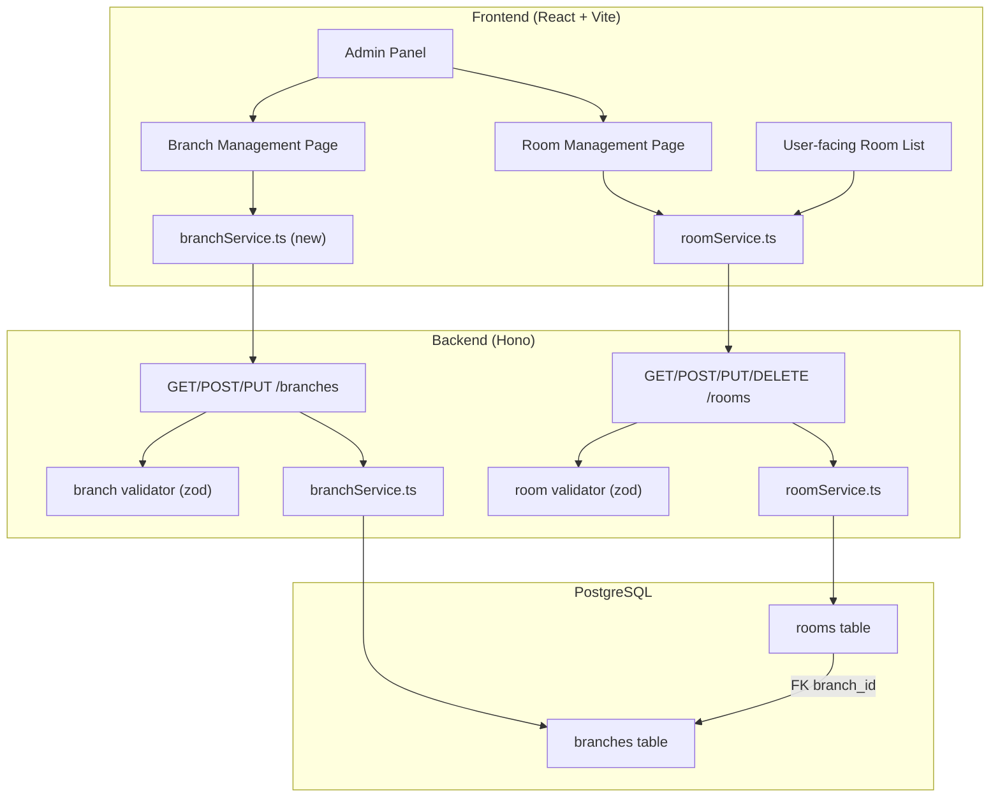
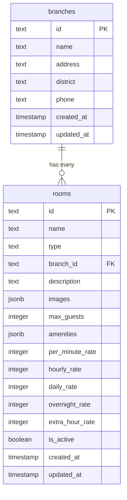

# Design Document: Admin Room & Branch Management

## Overview

Tính năng quản lý phòng và chi nhánh cho Admin Panel của hệ thống đặt phòng homestay. Hệ thống hiện tại đã có sẵn backend API (Hono + Drizzle ORM + PostgreSQL) với các endpoint CRUD cho rooms và branches, cùng frontend React + TypeScript sử dụng Vite.

**Thay đổi chính so với hệ thống hiện tại:**
- Thêm trường `perMinuteRate` (giá theo phút) vào schema phòng — hiện tại chỉ có hourlyRate/dailyRate/overnightRate/extraHourRate
- Xây dựng UI quản lý phòng đầy đủ (tạo/sửa/vô hiệu hóa) — hiện tại chỉ có quản lý hình ảnh
- Xây dựng UI quản lý chi nhánh (tạo/sửa) — hiện tại chưa có
- Cập nhật User-facing UI hiển thị giá theo phút

**Quyết định thiết kế:**
- Giữ nguyên kiến trúc hiện tại (Hono routes → services → Drizzle ORM)
- Thêm `perMinuteRate` song song với các rate hiện có (không thay thế)
- Sử dụng soft delete cho phòng (đã có sẵn `isActive` flag)
- Frontend sử dụng pattern đã có: `apiFetch` + React state + `sonner` toast

## Architecture



### Luồng dữ liệu

1. **Tạo phòng**: Admin Form → `roomService.create()` → `POST /rooms` → zod validation → `roomService.create()` → DB insert → response
2. **Sửa phòng**: Admin Form → `roomService.update()` → `PUT /rooms/:id` → zod validation → `roomService.update()` → DB update → response
3. **Vô hiệu hóa**: Confirm dialog → `roomService.deactivate()` → `DELETE /rooms/:id` → `roomService.softDelete()` → DB update isActive=false
4. **User xem phòng**: Page load → `roomService.getAll()` → `GET /rooms` → DB query (isActive=true) → render room cards

## Components and Interfaces

### Backend Changes

#### 1. Database Schema Migration

Thêm cột `per_minute_rate` vào bảng `rooms`:

```typescript
// backend/src/db/schema/rooms.ts — thêm cột
perMinuteRate: integer('per_minute_rate').notNull().default(0),
```

#### 2. Room Validator Update

```typescript
// backend/src/validators/room.ts
export const createRoomSchema = z.object({
  name: z.string().min(1, 'Tên phòng là bắt buộc'),
  type: z.enum(['standard', 'vip', 'supervip']),
  branchId: z.string().nullable().optional(),
  description: z.string().optional(),
  images: z.array(z.string()).max(5).default([]),
  maxGuests: z.number().int().min(1).default(2),
  amenities: z.array(z.string()).default([]),
  perMinuteRate: z.number().int().min(1, 'Giá theo phút phải lớn hơn 0'),
  hourlyRate: z.number().int().min(0),
  dailyRate: z.number().int().min(0),
  overnightRate: z.number().int().min(0),
  extraHourRate: z.number().int().min(0),
});
```

#### 3. Branch Validator (new)

```typescript
// backend/src/validators/branch.ts
export const createBranchSchema = z.object({
  name: z.string().min(1, 'Tên chi nhánh là bắt buộc'),
  address: z.string().min(1, 'Địa chỉ là bắt buộc'),
  district: z.string().optional(),
  phone: z.string().optional(),
});

export const updateBranchSchema = createBranchSchema.partial();
```

#### 4. API Endpoints (đã có, cần cập nhật)

| Method | Endpoint | Auth | Mô tả |
|--------|----------|------|--------|
| GET | `/rooms` | Public | Lấy danh sách phòng active (filter: branchId, type) |
| GET | `/rooms/:id` | Public | Chi tiết phòng |
| POST | `/rooms` | Admin | Tạo phòng mới |
| PUT | `/rooms/:id` | Admin | Cập nhật phòng |
| DELETE | `/rooms/:id` | Admin | Soft delete (isActive=false) |
| GET | `/branches` | Auth | Danh sách chi nhánh |
| GET | `/branches/:id` | Auth | Chi tiết chi nhánh |
| POST | `/branches` | Admin | Tạo chi nhánh |
| PUT | `/branches/:id` | Admin | Cập nhật chi nhánh |

### Frontend Changes

#### 1. Types Update

```typescript
// frontend/src/types/room.ts — thêm perMinuteRate
export interface RoomDetail {
  id: string;
  name: string;
  type: RoomType;
  branchId: string | null;
  description: string | null;
  images: string[];
  maxGuests: number;
  amenities: string[];
  perMinuteRate: number;
  hourlyRate: number;
  dailyRate: number;
  overnightRate: number;
  extraHourRate: number;
  isActive: boolean;
  createdAt: string;
  updatedAt: string;
}

// frontend/src/types/branch.ts (new)
export interface Branch {
  id: string;
  name: string;
  address: string;
  district: string | null;
  phone: string | null;
  createdAt: string;
  updatedAt: string;
}
```

#### 2. Frontend Services

```typescript
// frontend/src/services/roomService.ts — thêm methods
export async function create(data: CreateRoomPayload): Promise<RoomDetail> { ... }
export async function update(id: string, data: Partial<CreateRoomPayload>): Promise<RoomDetail> { ... }
export async function deactivate(id: string): Promise<void> { ... }

// frontend/src/services/branchService.ts (new)
export async function getAll(): Promise<Branch[]> { ... }
export async function getById(id: string): Promise<Branch> { ... }
export async function create(data: CreateBranchPayload): Promise<Branch> { ... }
export async function update(id: string, data: Partial<CreateBranchPayload>): Promise<Branch> { ... }
```

#### 3. Admin UI Components

```
frontend/src/components/admin/
├── room-management.tsx        (mở rộng — thêm CRUD form)
├── room-form-modal.tsx        (new — modal tạo/sửa phòng)
├── branch-management.tsx      (new — trang quản lý chi nhánh)
├── branch-form-modal.tsx      (new — modal tạo/sửa chi nhánh)
```

#### 4. Room Form Modal

Form fields:
- `name` (text, required) — Tên phòng
- `type` (select: standard/vip/supervip, required) — Loại phòng
- `branchId` (select from branches, optional) — Chi nhánh
- `perMinuteRate` (number, required, > 0) — Giá theo phút (VNĐ)
- Hiển thị tính toán: `perMinuteRate × 60 = hourlyEquivalent`
- `hourlyRate` (number) — Giá theo giờ
- `dailyRate` (number) — Giá theo ngày
- `overnightRate` (number) — Giá qua đêm
- `extraHourRate` (number) — Giá giờ phụ trội
- `maxGuests` (number, default 2) — Số khách tối đa
- `description` (textarea, optional) — Mô tả
- `amenities` (tag input, optional) — Tiện nghi

#### 5. Branch Form Modal

Form fields:
- `name` (text, required) — Tên chi nhánh
- `address` (text, required) — Địa chỉ
- `district` (text, optional) — Quận/huyện
- `phone` (text, optional) — Số điện thoại

#### 6. Routing

Thêm routes mới trong `main.tsx`:
```typescript
<Route path="rooms" element={<RoomManagementPage />} />
<Route path="branches" element={<BranchManagement />} />
```

## Data Models

### Database Schema



### Migration Plan

1. Thêm cột `per_minute_rate` với default 0
2. Chạy migration script để tính `per_minute_rate` từ `hourly_rate / 60` cho các phòng hiện có
3. Cập nhật validator để yêu cầu `perMinuteRate` khi tạo phòng mới

### Pricing Calculation

```typescript
// Tính giá booking theo phút
function calculateBookingCost(perMinuteRate: number, durationMinutes: number): number {
  return perMinuteRate * durationMinutes;
}

// Hiển thị hourly equivalent trên form
function getHourlyEquivalent(perMinuteRate: number): number {
  return perMinuteRate * 60;
}
```

## Correctness Properties

*A property is a characteristic or behavior that should hold true across all valid executions of a system — essentially, a formal statement about what the system should do. Properties serve as the bridge between human-readable specifications and machine-verifiable correctness guarantees.*

### Property 1: Room creation round-trip

*For any* valid room data (with valid name, type in ['standard','vip','supervip'], and perMinuteRate > 0), creating a room via the API and then fetching it by ID should return a room object where all input fields match the original data.

**Validates: Requirements 1.1, 4.1**

### Property 2: Room update round-trip

*For any* existing room and any valid partial update data, updating the room via the API and then fetching it should return a room where the updated fields match the new values and non-updated fields remain unchanged.

**Validates: Requirements 2.2**

### Property 3: Per-minute rate hourly calculation

*For any* positive integer perMinuteRate, the calculated hourly equivalent should always equal perMinuteRate × 60, and for any perMinuteRate and positive integer duration in minutes, the total cost should equal perMinuteRate × duration.

**Validates: Requirements 1.3, 4.4**

### Property 4: Room validation rejects invalid data

*For any* room creation payload where name is empty OR type is not in ['standard','vip','supervip'] OR perMinuteRate is ≤ 0 or not an integer, the API should return a 400 status code with descriptive error messages.

**Validates: Requirements 1.4, 1.5, 4.3**

### Property 5: Active room filtering invariant

*For any* set of rooms with mixed isActive status, the public GET /rooms endpoint should return only rooms where isActive is true. Equivalently, for any room that has been soft-deleted, it should never appear in the public room list.

**Validates: Requirements 3.1, 3.3, 7.1, 7.3**

### Property 6: Branch creation and update round-trip

*For any* valid branch data (with non-empty name and address), creating a branch and then fetching it should return a branch where all fields match. Similarly, for any valid partial update, the updated branch should reflect the changes.

**Validates: Requirements 5.1, 6.2**

### Property 7: Branch validation rejects invalid data

*For any* branch creation payload where name is empty OR address is empty, the API should return a 400 status code with descriptive error messages.

**Validates: Requirements 5.3, 5.4**

### Property 8: Branch filtering for rooms

*For any* branchId filter applied to GET /rooms, all returned rooms should have their branchId equal to the filter value. No room belonging to a different branch should appear in the results.

**Validates: Requirements 8.3**

### Property 9: Room display contains required pricing info

*For any* room with a perMinuteRate value, the formatted display string should match the pattern "{number} đ/phút" and the number should equal the room's perMinuteRate.

**Validates: Requirements 4.2, 7.4**

## Error Handling

### Backend Error Handling

| Tình huống | HTTP Status | Error Message |
|------------|-------------|---------------|
| Thiếu required fields | 400 | Mô tả cụ thể field nào thiếu (từ zod) |
| perMinuteRate ≤ 0 | 400 | "Giá theo phút phải lớn hơn 0" |
| Room type không hợp lệ | 400 | "Type must be standard, vip, or supervip" |
| Room không tồn tại | 404 | "Room not found" |
| Branch không tồn tại | 404 | "Branch not found" |
| Không có quyền | 403 | "Forbidden: Insufficient permissions" |
| Chưa đăng nhập | 401 | "Unauthorized" |

Sử dụng `AppError` class hiện có và `errorHandler` middleware để xử lý lỗi thống nhất.

### Frontend Error Handling

- **Form validation**: Sử dụng React state để hiển thị lỗi inline cho từng field
- **API errors**: Catch `ApiError` từ `apiFetch`, hiển thị toast error với message từ server
- **Network errors**: Hiển thị toast "Không thể kết nối server" và cho phép retry
- **Optimistic UI**: Không áp dụng cho create/update/delete — chờ server confirm trước khi cập nhật UI

### Edge Cases

- Tạo phòng không chọn chi nhánh → `branchId = null` (cho phép)
- Vô hiệu hóa phòng đang có booking → Cho phép (booking hiện tại vẫn giữ, phòng chỉ ẩn khỏi danh sách public)
- Sửa phòng đang inactive → Cho phép (admin vẫn thấy phòng inactive trong danh sách quản lý)
- Branch bị xóa khi có phòng liên kết → Không hỗ trợ xóa branch (chỉ sửa)

## Testing Strategy

### Property-Based Testing (PBT)

**Library**: `vitest` + `fast-check` (cho TypeScript)

Mỗi property test chạy tối thiểu 100 iterations với dữ liệu ngẫu nhiên.

**Tests cần implement:**

1. **Room CRUD round-trip** — Feature: admin-room-branch-management, Property 1 & 2
2. **Per-minute rate calculation** — Feature: admin-room-branch-management, Property 3
3. **Room validation** — Feature: admin-room-branch-management, Property 4
4. **Active room filtering** — Feature: admin-room-branch-management, Property 5
5. **Branch CRUD round-trip** — Feature: admin-room-branch-management, Property 6
6. **Branch validation** — Feature: admin-room-branch-management, Property 7
7. **Branch filtering** — Feature: admin-room-branch-management, Property 8
8. **Price formatting** — Feature: admin-room-branch-management, Property 9

### Unit Tests (Example-Based)

- Form rendering: verify all required fields present
- Confirmation dialog: verify dialog appears before deactivation
- Success notifications: verify toast after CRUD operations
- Edit form population: verify form pre-filled with current data
- Branch dropdown in room form: verify branches loaded and selectable

### Integration Tests

- Full flow: create branch → create room with branchId → verify room appears in public list
- Deactivation flow: create room → deactivate → verify excluded from public list
- Auth flow: verify unauthenticated requests rejected, non-admin requests forbidden

### Test Configuration

```typescript
// vitest.config.ts — đã có sẵn
// Thêm fast-check dependency:
// npm install -D fast-check

// Mỗi property test tag format:
// Feature: admin-room-branch-management, Property {N}: {description}
```
