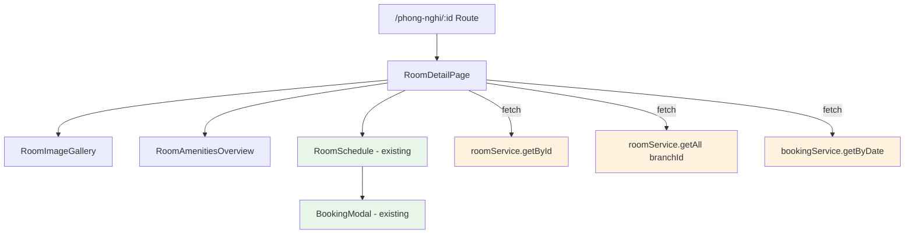
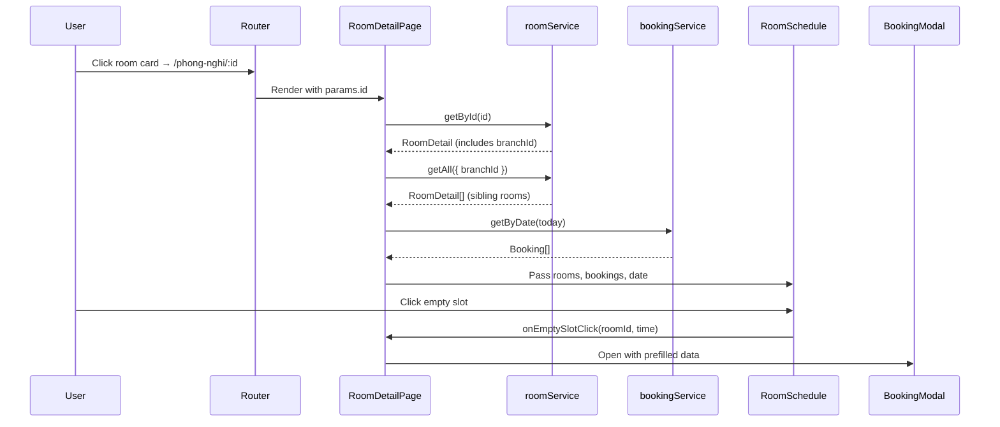

# Design Document: Room Detail Page

## Overview

The Room Detail Page (`/phong-nghi/:id`) is a user-facing page that displays comprehensive information about a specific room at the homestay. It consists of three main sections:

1. **Image Gallery** — A collage layout showcasing room photos (same proportions as RoomCard: flex-5 | flex-3 | flex-2)
2. **Room Amenities Overview** — Displays the current room's amenities with icons
3. **Schedule Timeline** — A Gantt-chart showing bookings for all rooms in the same branch, with date picker, room type filters, and booking creation capability

The page reuses the existing `RoomSchedule` component for the timeline and `BookingModal` for creating bookings, while introducing a new `RoomImageGallery` component for the enlarged collage display.

## Architecture



### Data Flow



### Routing Setup

Add the route `/phong-nghi/:id` inside the existing `App` layout route in `main.tsx`:

```tsx
<Route path="/phong-nghi/:id" element={<RoomDetailPageRoute />} />
```

This sits alongside the existing `/phong-nghi` route (room list). The new `RoomDetailPageRoute` component extracts the `id` param and renders the `RoomDetailPage`.

## Components and Interfaces

### 1. RoomDetailPageRoute (new)

**Path:** `frontend/src/components/rooms/RoomDetailPageRoute.tsx`

Thin route wrapper that extracts the room ID from URL params and manages data fetching.

```typescript
// No props — reads from URL params
// Internal state:
interface RoomDetailPageState {
  room: RoomDetail | null;
  branchRooms: RoomDetail[];
  bookings: Booking[];
  selectedDate: Date;
  loading: boolean;
  error: string | null;
}
```

**Responsibilities:**
- Extract `id` from `useParams()`
- Fetch room detail via `roomService.getById(id)`
- Fetch sibling rooms via `roomService.getAll({ branchId: room.branchId })`
- Fetch bookings via `bookingService.getByDate(dateStr)`
- Handle loading/error states
- Pass data down to presentational components

### 2. RoomImageGallery (new)

**Path:** `frontend/src/components/rooms/RoomImageGallery.tsx`

```typescript
interface RoomImageGalleryProps {
  images: string[];       // Already resolved via imageUrl()
  roomName: string;       // For alt attributes
}
```

**Layout:** Same collage as `RoomCard` but larger:
- Left: flex-5, single large image (main photo)
- Center: flex-3, single medium image
- Right: flex-2, three small images stacked vertically

**Image slot filling logic:**
```typescript
function fillImageSlots(images: string[], slots: number = 5): string[] {
  if (images.length === 0) return Array(slots).fill('/images/placeholder-room.png');
  return Array.from({ length: slots }, (_, i) => images[i % images.length]);
}
```

**Responsive behavior:**
- Desktop (≥768px): Horizontal collage with flex layout
- Mobile (<768px): Vertical stack of images

### 3. RoomAmenitiesOverview (new)

**Path:** `frontend/src/components/rooms/RoomAmenitiesOverview.tsx`

```typescript
interface RoomAmenitiesOverviewProps {
  amenities: string[];    // Array of amenity strings from RoomDetail
  roomName: string;       // For section context
}
```

**Rendering logic:**
- Maps each amenity string to an icon + label pair
- Uses a predefined icon mapping (emoji-based, matching existing pattern in RoomSchedule)
- Shows fallback message "Chưa có thông tin tiện nghi" when array is empty

### 4. RoomSchedule (existing — reused)

The existing `RoomSchedule` component is reused as-is. It already supports:
- Date picker with `onDateChange` callback
- Room type filter tabs (Tiêu chuẩn, VIP, SuperVip)
- Timeline with booking blocks
- Empty slot click → `onEmptySlotClick` callback
- Booking creation via `onBookingCreate` callback
- Current time indicator
- Amenity legend in footer

**Adaptation needed:** The `RoomSchedule` currently accepts `Room[]` (id, name, type). The `RoomDetailPage` will map `RoomDetail[]` → `Room[]` before passing to the schedule.

### 5. BookingModal (existing — reused)

The existing `BookingModal` from `booking-calendar-form/booking-modal.tsx` is already integrated within `RoomSchedule`. No changes needed.

## Data Models

### RoomDetail (existing type)

```typescript
interface RoomDetail {
  id: string;
  name: string;
  type: RoomType;              // 'standard' | 'vip' | 'supervip'
  branchId: string | null;
  description: string | null;
  images: string[];            // Relative paths
  maxGuests: number;
  amenities: string[];
  perMinuteRate: number;
  hourlyRate: number;
  dailyRate: number;
  overnightRate: number;
  extraHourRate: number;
  isActive: boolean;
  createdAt: string;
  updatedAt: string;
}
```

### Room (schedule type — mapped from RoomDetail)

```typescript
interface Room {
  id: string;
  name: string;
  type: RoomType;
}
```

### Mapping function

```typescript
function toScheduleRoom(detail: RoomDetail): Room {
  return { id: detail.id, name: detail.name, type: detail.type };
}
```

### Booking (existing type — from localStorage via bookingService)

```typescript
interface Booking {
  id: string;
  roomId: string;
  date: string;           // YYYY-MM-DD
  startTime: string;      // HH:mm
  endTime: string;        // HH:mm
  guestName?: string;
  status: BookingStatus;
  totalPrice: number;
  category: BookingCategory;
  // ... other fields
}
```

## Correctness Properties

*A property is a characteristic or behavior that should hold true across all valid executions of a system — essentially, a formal statement about what the system should do. Properties serve as the bridge between human-readable specifications and machine-verifiable correctness guarantees.*

### Property 1: Image slot filling always produces exactly 5 slots

*For any* non-empty array of images with length N (where 1 ≤ N ≤ any positive integer), the `fillImageSlots` function SHALL return an array of exactly 5 elements, where each element at index `i` equals `images[i % N]`.

**Validates: Requirements 2.3**

### Property 2: imageUrl resolves relative paths correctly

*For any* string path, if the path starts with "http" then `imageUrl(path)` SHALL return the path unchanged; otherwise `imageUrl(path)` SHALL return a string that starts with the backend origin and ends with the original path.

**Validates: Requirements 2.4**

### Property 3: Room type filter displays exactly matching rooms

*For any* set of rooms with various types and any combination of active filter states (standard: on/off, vip: on/off, supervip: on/off), the filtered room list SHALL contain exactly those rooms whose type matches at least one active filter, and no others.

**Validates: Requirements 3.5, 5.6**

### Property 4: All amenities are rendered

*For any* non-empty array of amenity strings, the rendered amenities section SHALL contain every string from the input array.

**Validates: Requirements 4.2, 4.3**

### Property 5: Booking block position is proportional to time

*For any* booking with startTime and endTime within the timeline range [startHour, endHour], the computed `left` position SHALL equal `((startMinutes - startHour*60) / 60) * HOUR_WIDTH` and the computed `width` SHALL equal `((endMinutes - startMinutes) / 60) * HOUR_WIDTH`.

**Validates: Requirements 5.3**

### Property 6: Amenity legend respects active room type filters

*For any* set of rooms and any filter state, the amenity legend SHALL only display rooms whose type matches at least one active filter — the set of rooms in the legend SHALL be a subset of (and equal to) the set of rooms visible in the timeline.

**Validates: Requirements 6.2, 6.3**

### Property 7: All gallery images have descriptive alt attributes

*For any* room name and any array of images, every `` element rendered in the gallery SHALL have a non-empty `alt` attribute that contains the room name or a descriptive variant thereof.

**Validates: Requirements 7.5**

## Error Handling

| Scenario | Handling |
|----------|----------|
| Room ID not found (404) | Display "Phòng không tìm thấy" message with link back to `/phong-nghi` |
| Network error on room fetch | Display generic error message with retry button |
| Room has no branchId | Skip fetching sibling rooms; show only the current room in timeline |
| Room has no images | Use placeholder image for all 5 gallery slots |
| Room has empty amenities | Show "Chưa có thông tin tiện nghi" message |
| Booking creation fails | Toast error via `sonner`; timeline remains unchanged |
| bookingService returns empty for date | Timeline shows empty rows (no booking blocks) — handled by existing RoomSchedule |

## Testing Strategy

### Property-Based Tests (using fast-check)

Each correctness property will be implemented as a property-based test with minimum 100 iterations:

1. **fillImageSlots** — Generate random image arrays (length 1-20), verify output is always length 5 with correct cycling
2. **imageUrl** — Generate random strings (with/without "http" prefix), verify correct resolution
3. **Room type filtering** — Generate random room lists and filter states, verify exact match
4. **Amenities rendering** — Generate random amenity arrays, verify all present in output
5. **getBookingPosition** — Generate random start/end times within valid range, verify pixel math
6. **Legend filter consistency** — Generate rooms + filters, verify legend matches filtered set
7. **Alt attributes** — Generate random room names and image arrays, verify all imgs have alt with room name

**Configuration:**
- Library: `fast-check`
- Minimum iterations: 100 per property
- Tag format: `Feature: room-detail-page, Property {N}: {description}`

### Unit Tests (example-based)

- Route renders correctly with valid room ID
- Loading state displays spinner
- Error state displays message for invalid ID
- Date picker defaults to today
- All filter tabs active on initial render
- "Hướng dẫn" button navigates to `/huong-dan`
- Clicking empty slot opens BookingModal with correct prefill
- Current time indicator shows only for today's date
- Mobile layout stacks gallery vertically

### Integration Tests

- Full page load: route → fetch → render cycle
- Date change triggers booking refresh
- Booking creation updates timeline
- Navigation from room list to detail page
